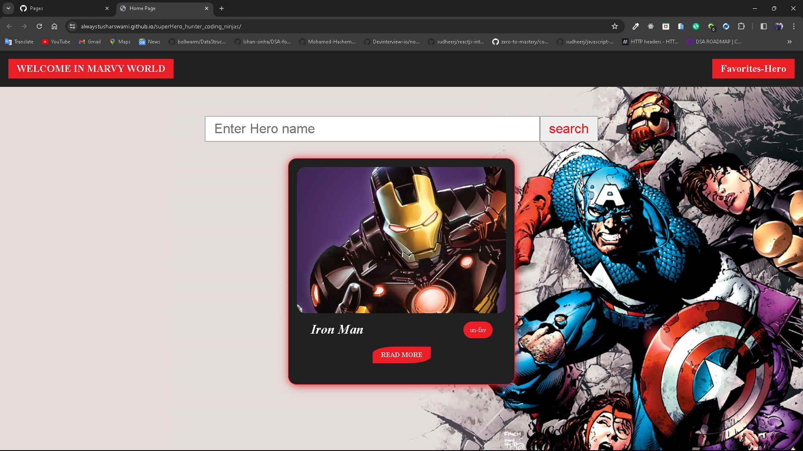

# Super Hero Hunter Website

In this website you can find your super hero details of Marvels and some more functionality like add fav and un-fav super hero.

# Hosted Link

[Marvy World >>](https://alwaystusharswami.github.io/superHero_hunter_coding_ninjas/)

# Feature

1. Search any super hero from marvel APIs.
2. Each result have fav button ,
   click any super hero fav button it store in your fav list
3. get more detail of super hero you click on **Read More**
4. by click on it show information like of super hero like its name, photo, description,stories,comics,series, etc.
5. Add fav List of super hero button in navbar if you click on it you go to fav list section
6. you can also un-fav from fav list and main page also.

# Function Details

1. if you click on input box and type something. it will show show you hero name in suggestion and click on particluar name it send to input value and you hit enter or click on submit then show some detail of our hero.
2. show some basic detail on home page if you click on fav and un-fav and also one function of read more about super hero it will send to another page of more information.
3. one button on navbar to go to fav list page where you can un-fav your super hero.

# ScreenShot

## Home page

## input suggestion box

## search by particular hero by name

## More details of our hero

## favorite page

# Created with help

1. HTML
2. CSS
3. Vanilla JavaScript
4. Marvel Api => URL = `https://gateway.marvel.com/v1/public/characters/`
5. Vs code
